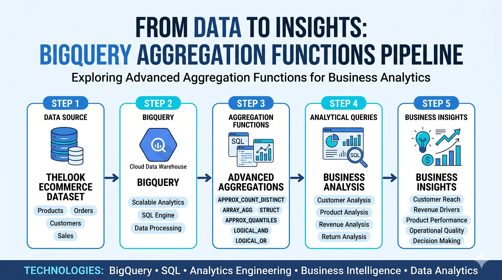

# BigQuery — Agregações Especiais em E-commerce




Projeto desenvolvido para explorar funções avançadas de agregação do BigQuery utilizando o dataset público TheLook E-commerce.

---

# Objetivo

Demonstrar a aplicação de funções avançadas de agregação do BigQuery para responder perguntas de negócio e gerar insights comerciais e operacionais a partir de grandes volumes de dados.

---

# Dataset

**Fonte:**

`bigquery-public-data.thelook_ecommerce`

**Tabelas utilizadas:**

- order_items
- products
- orders
- users

---

# Consultas Desenvolvidas

| Consulta | Função Principal |
|-----------|------------------|
| 01_clientes_unicos | APPROX_COUNT_DISTINCT |
| 02_top_clientes_categoria | ARRAY_AGG |
| 03_marcas_por_categoria | ARRAY_AGG |
| 04_distribuicao_precos_departamento | APPROX_QUANTILES |
| 05_clientes_com_todos_pedidos_entregues | LOGICAL_AND |
| 06_clientes_com_devolucao | LOGICAL_OR |
| 07_top_produtos_receita | ARRAY_AGG + STRUCT |

---

# Funções Exploradas

## APPROX_COUNT_DISTINCT

Estimativa eficiente de clientes únicos por categoria, reduzindo custo computacional em grandes volumes de dados.

## ARRAY_AGG

Construção de listas estruturadas para agrupamento de clientes, marcas e produtos.

## STRUCT

Criação de estruturas aninhadas para organização de resultados analíticos complexos.

## APPROX_QUANTILES

Análise da distribuição de preços por departamento utilizando quartis.

## LOGICAL_AND

Validação de clientes cujos pedidos foram totalmente entregues.

## LOGICAL_OR

Identificação de clientes com pelo menos uma devolução registrada.

---

# Principais Insights

## Categorias com maior alcance de clientes

- Jeans
- Intimates
- Tops & Tees

## Categorias com maior receita

- Outerwear & Coats
- Jeans
- Sweaters

## Distribuição de preços

### Departamento Masculino

| Métrica | Valor |
|----------|--------|
| Mínimo | 1.5 |
| Q1 | 25.0 |
| Mediana | 44.0 |
| Q3 | 70.0 |
| Máximo | 999.0 |

### Departamento Feminino

| Métrica | Valor |
|----------|--------|
| Mínimo | 0.0 |
| Q1 | 21.1 |
| Mediana | 37.0 |
| Q3 | 68.7 |
| Máximo | 903.0 |

---

# Tecnologias

- Google BigQuery
- SQL (GoogleSQL)
- GitHub

---

# Competências Desenvolvidas

- SQL Analítico
- BigQuery
- Funções Avançadas de Agregação
- Manipulação de Arrays e Structs
- Modelagem de Consultas
- Análise Exploratória de Dados (EDA)
- Business Analytics
- Documentação Técnica
- Versionamento com Git e GitHub
- Pensamento Analítico Orientado a Negócios

---

# Estrutura do Projeto

```text
sql/
├── 01_clientes_unicos.sql
├── 02_top_clientes_categoria.sql
├── 03_marcas_por_categoria.sql
├── 04_distribuicao_precos_departamento.sql
├── 05_clientes_com_todos_pedidos_entregues.sql
├── 06_clientes_com_devolucao.sql
├── 07_top_produtos_receita.sql
└── README.md
```

---

# Autor

**Antonio Neto**

Projeto desenvolvido como parte da jornada de evolução em SQL, BigQuery, Analytics Engineering e Engenharia Analítica Moderna.
